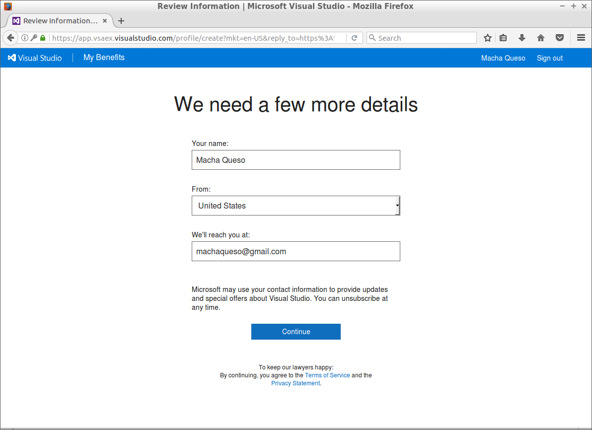
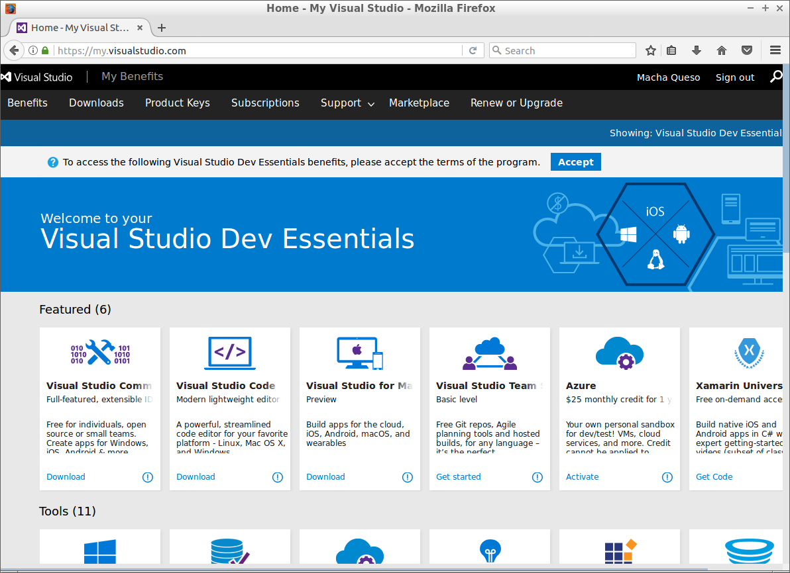
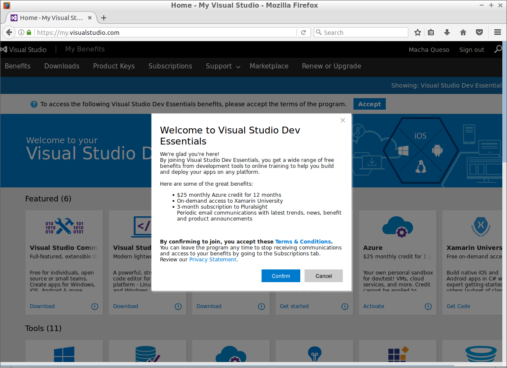

# AzureDevEnv
Visual Studio Dev Essentials (which is free) includes $25/month of Azure credits for 1 year. This document explains how to use this benefit to spin up a virtual development environment and work on the cloud for free!

## Requirements
* Computer with internet access
* A modern web browser (Latest Chrome or Firefox should do)
* A credit card (to create azure account, will not be charged)

## 1. Create Visual Studio Dev Essentials account

1. Open your web browser and navigate to [my.visualstudio.com](http://my.visualstudio.com)
1. Login with your Microsoft Account, if you don't have one, create it.
1. If this is your first time, you will be asked to verify some details. Complete the form and click continue.

4. At the top of the screen find the button to accept terms and click it.

5. Click confirm to accept the terms of Visual Studio Dev Essentials.

## 2. Activate the free Azure benefit

